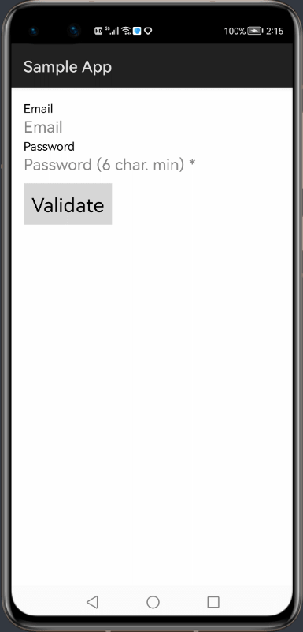

  

  
  
# OhosVerify

Ohos library designed for rapid and customizable form validation. 

# Source

The library was ported for HarmonyOS from the mentioned Android Library:
[AndroidVerify](https://github.com/pchmn/AndroidVerify/) (version 1.0.2)

## Features

The library supports rapid and customizable form validation which can be integrated using Java Builder functions or wrapping text fields via XML. It supports validation for Numeric, Phone Number, Email, IP Address, URL, Regex, Identical fields, Minimum/Maximum/Range value, and Minimum/Maximum/Range character length. The validators can also be [customized](#advanced-usage) as required.

  
## Dependency
1. For using LiteGo module in sample app, include the source code and add the below dependencies in entry/build.gradle to generate hap/support.har.
```
	dependencies {
		implementation project(':ohosverify')
		testCompile 'junit:junit:4.12'
	}
```
2. For using LiteGo module in separate application using har file, add the har file in the entry/libs folder and add the dependencies in entry/build.gradle file.
```
	dependencies {
		implementation fileTree(dir: 'libs', include: ['*.har'])
		testCompile 'junit:junit:4.12'
	}

```

## Usage

You can use **OhosVerify** with any `Component` that extends the original [`TextField`].

### With XML

You just have to wrap your `TextField` with an `InputValidator` view. Example for an email and a custom regex :

```xml
<com.pchmn.ohosverify.InputValidator
    ohos:width="wrap_content"
    ohos:height="wrap_content"
    app:required="true"
    app:validator="isEmail"
    app:requiredMessage="Email required">

    <TextField
        ohos:width="match_parent"
        ohos:height="match_content"
        ohos:inputType="textEmailAddress"
        ohos:hint="Email"/>

</com.pchmn.ohosverify.InputValidator>
            
<com.pchmn.ohosverify.InputValidator
    ohos:width="match_content"
    ohos:height="match_content"
    app:regex="^[0-9]{4}$"
    app:errorMessage="4 digits only">

    <TextField
        ohos:width="match_content"
        ohos:height="match_content"
        ohos:hint="Regex 4 digits (custom error msg)"/>

</com.pchmn.ohosverify.InputValidator>            
```

**Note:** Be sure to add `xmlns:app="http://schemas.huawei.com/hap/res-auto"` next to `xmlns:ohos` for custom attributes to work.

`InputValidator` can be set to recognize email, phone, IP address, URL or number using `validator` attribute.
<br>If you don't specify an `errorMessage` or a `requiredMessage`, predefined messages will be shown if the field is not valid.

Then **validate** your form :
```java
// Initiate using context and a ComponentContainer that holds the InputValidators
// This example assumes a DirectionalLayout that contains the InputValidators

DirectionalLayout mComponentContainer = 
	(DirectionalLayout) findComponentById(ResourceTable.Id_form);

Form form = new Form.Builder(this, mComponentContainer)
    .showErrors(true)
    .build();

// validate the form
if(form.isValid()) {
    // the form is valid
}
else {
    // the form is not valid
}        
```

### With Java

You can create programmatically `InputValidator` without passing by XML ([see all Builder methods](#inputvalidator-builder)) :

```java
// create the validator with the Builder
// emailTextField is the TextField to validate 
// 'this' represents a Context
InputValidator emailValidator = new InputValidator.Builder(this)
    .on(emailTextField)
    .required(true)
    .validatorType(InputValidator.IS_EMAIL)
    .build();
                
// create the form and add the validator
Form form = new Form.Builder(this)
    .addInputValidator(emailValidator)
    .build();
    
// validate the form
if(form.isValid()) {
    // the form is valid
}
else {
    // the form is not valid
}
```

You can create programmatically without using the Builders, but it is safer and quicker to use Builders.

### Attributes

#### `InputValidator`
All the attributes that can be used with `InputValidator` . They can be used in XML or in Java with setters :

Attribute | Type | Description
--- | --- | ---
`app:required` | `boolean` | Whether the field is required or not
`app:validator` | `enum` | Use a validator type predefined by FormValidator. You can use **isEmail**, **isPhoneNumber**, **isNumeric**, **isUrl** or **isIP**
`app:minLength` | `int` | The minimum length of the field
`app:maxLength` | `int` | The maximum length of the field
`app:minValue` | `int` | The minimum value of the field (must be numeric)
`app:maxValue` | `int` | The maximum value of the field (must be numeric)
`app:regex` | `string` | Use a regex to validate a field
`app:identicalAs` | `reference id` | The id of an TextField to which the field must be equal <sup>*</sup>
`app:errorMessage` | `string` | The message to display if the field is not valid
`app:requiredMessage` | `string` | The message to display if the field is empty but was required. It implies that the field is required

<sup>*</sup> Has limitations. Use Java builder methods for identical validators to avoid any issues.

#### `Form`
All the attributes that can be used with `Form`. They can be used in XML or in Java with setters :

Attribute | Type | Default | Description
--- | --- | --- | ---
`app:showErrors` | `boolean` | `true` | Whether the errors must be shown on each TextField or not


## Advanced Usage

### Use a custom validator

You can use a custom validator for an `InputValidator` : 
```java
// the InputValidator was present in the XML layout
InputValidator mInputValidator = (InputValidator) findComponentById(ResourceTable.Id_input_validator);
// your custom validator must extends AbstractValidator class
mInputValidator.setCustomValidator(new AbstractValidator() {
    @Override
    public boolean isValid(String value) {
        return value.equals("ok man");
    }
              
    @Override
    public String getErrorMessage() {
        return "This field must be equals to 'ok man'";
    }
});


// or create your InputValidator with the Builder
InputValidator inputValidator = new InputValidator.Builder(this)
    .on(aTextField)
    .customValidator(new AbstractValidator() {
        @Override
        public boolean isValid(String value) {
            return value.equals("ok man");
        }
                  
        @Override
        public String getErrorMessage() {
            return "This field must be equals to 'ok man'";
        }
    });
    .build();
```


### Use the `Form` component in XML

If you want, you can use a `Form` component directly in XML. This view extends [`DirectionalLayout`](https://developer.harmonyos.com/en/docs/documentation/doc-references/directionallayout-0000001054238715). It must wrap all the fields you want to check.

It can be useful for these reasons : 
* You don't have to instantiate a `Form` object before validate the form
* It will be easier to identify a form in your XML layout
* You can use two different and independent forms in the same XML layout

#### XML
```xml
<!-- form1 -->
<com.pchmn.ohosverify.Form
	ohos:id="$+id:form1"
	ohos:orientation="vertical"
	ohos:width="match_parent"
	ohos:height="match_content"
	ohos:padding="16fp">

	<!-- email -->
	<com.pchmn.ohosverify.InputValidator
		ohos:width="match_content"
		ohos:height="match_content">

		<TextField
			ohos:width="match_parent"
			ohos:height="match_content"
			ohos:text_size="20fp"
			ohos:hint="Email"/>

	</com.pchmn.ohosverify.InputValidator>

	<!-- password -->
	<com.pchmn.ohosverify.InputValidator
		ohos:width="match_content"
		ohos:height="match_content"
		app:required="true"
		app:minLength="6">

		<TextField
			ohos:width="match_parent"
			ohos:height="match_content"
			ohos:text_input_type="pattern_password"
			ohos:text_size="20fp"
			ohos:hint="Password (6 char. min) *" />

	</com.pchmn.ohosverify.InputValidator>

	<!-- submit form -->
	<Button
		ohos:id="$+id:validate_form1"
		ohos:width="match_content"
		ohos:height="match_content"
		ohos:text_size="20fp"
		ohos:text="Validate form1"/>

</com.pchmn.ohosverify.Form>
<!-- /form1 -->

<!-- form2 -->
<com.pchmn.ohosverify.Form
	ohos:id="$+id:form2"
	ohos:orientation="vertical"
	ohos:width="match_parent"
	ohos:height="match_content"
	ohos:below="$+id:form1"
	ohos:padding="16fp">

	<!-- phone number -->
	<com.pchmn.ohosverify.InputValidator
		ohos:id="$+id:tiv1"
		ohos:width="match_content"
		ohos:height="match_content"
		app:required="true">

		<TextField
			ohos:width="match_parent"
			ohos:height="match_content"
			ohos:text_input_type="pattern_number"
			ohos:text_size="20fp"
			ohos:hint="Phone number *"/>

	</com.pchmn.ohosverify.InputValidator>

	<!-- age -->
	<com.pchmn.ohosverify.InputValidator
		ohos:width="match_content"
		ohos:height="match_content"
		app:minValue="12">

		<TextField
			ohos:width="match_parent"
			ohos:height="match_content"
			ohos:text_input_type="pattern_number"
			ohos:text_size="20fp"
			ohos:hint="Age (12 min)" />

	</com.pchmn.ohosverify.InputValidator>

	<!-- submit form -->
	<Button
		ohos:id="$+id:validate_form2"
		ohos:width="match_content"
		ohos:height="match_content"
		ohos:text_size="20fp"
		ohos:text="Validate form2"/>

</com.pchmn.ohosverify.Form>
<!-- /form2 -->
```

#### Validate the forms

```java
// get the forms
// you don't have to instantiate them because they already know the fields they have to validate
Form form1 = (Form) findComponentById(ResourceTable.Id_form1);
Form form2 = (Form) findComponentById(ResourceTable.Id_form2);

// validate form1
if(form1.isValid()) {
    // form1 is valid
}

// validate form2
if(form2.isValid()) {
    // form2 is valid
}

```


### Builders method

It is recommended to use the builders to create `Form` and `InputValidator` views programmatically in order to prevent some errors. All the attributes for the two views are supported by the builders.
 
#### `InputValidator` builder

```java
InputValidator inputValidator = new InputValidator.Builder(this)
    // methods
    .build();
```


Method | Return value | Description
--- | --- | ---
`InputValidator.Builder(Context context)` | `InputValidator.Builder` | The constructor of the builder
`on(TextField textField)` | `InputValidator.Builder` | The TextField to validate
`required(boolean required)` | `InputValidator.Builder` | Whether the field is required or not
`validatorType(int type)` | `InputValidator.Builder` | Use a validator type predefined by FormValidator. You can use **InputValidator.IS_EMAIL**, **InputValidator.IS_PHONE_NUMBER**, **InputValidator.IS_NUMERIC**, **InputValidator.IS_URL** or **InputValidator.IS_IP**
`customValidator(AbstractValidator validator)` | `InputValidator.Builder` | Use a custom validator
`minLength(int length)` | `InputValidator.Builder` | The minimum length of the field
`maxLength(int length)` | `InputValidator.Builder` | The maximum length of the field
`minValue(int value)` | `InputValidator.Builder` | The minimum value of the field (must be numeric)
`maxValue(int value)` | `InputValidator.Builder` | The maximum value of the field (must be numeric)
`regex(String regex)` | `InputValidator.Builder` | Use a regex to validate a field
`identicalAs(TextField textField` | `InputValidator.Builder` | An other TextField to which the field must be equal
`errorMessage(String message)` | `InputValidator.Builder` | The message to display if the field is not valid
`requiredMessage(String message)` | `InputValidator.Builder` | The message to display if the field is empty but was required
`build()` | `InputValidator` | Create the `InputValidator` object

#### `Form` builder

```java
Form form = new Form.Builder(this)
    // methods
    .build();
```

Method | Return value | Description
--- | --- | ---
`Form.Builder**(Context context, Component rootView)` | `Form.Builder` | Constructor of the builder
`addInputValidator(InputValidator validator)` | `Form.Builder` | Add an `InputValidator`
`showErrors(boolean show)` | `Form.Builder` | Whether the errors must be shown on each TextField or not
`build()` | `Form` | Create the `Form` object

## Sample

A sample app with some use cases of the library is available on this [link](entry/)

## Future Work

The error are shown on calling `isValid()` method via text field's hint text as shown. This can be toggled on and off via the `showErrors()` method in form builder. Future work would include showing error message as a separate floating text.




## License

```
Copyright 2017 pchmn

Licensed under the Apache License, Version 2.0 (the "License");
you may not use this file except in compliance with the License.
You may obtain a copy of the License at

   http://www.apache.org/licenses/LICENSE-2.0

Unless required by applicable law or agreed to in writing, software
distributed under the License is distributed on an "AS IS" BASIS,
WITHOUT WARRANTIES OR CONDITIONS OF ANY KIND, either express or implied.
See the License for the specific language governing permissions and
limitations under the License.
```